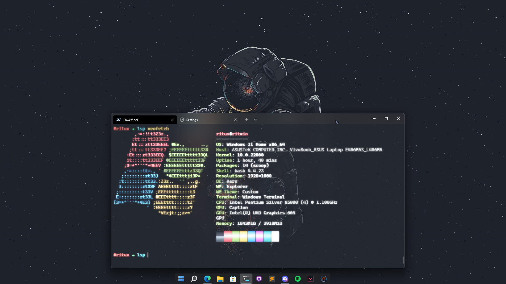

# Dotfiles for Windows

## My Windows Desktop

## What is dotfiles?

Dotfiles are the customization files that are used to personalize your Linux or other Unix-based system.  You can tell that a file is a dotfile because the name of the file will begin with a period–a dot!  The period at the beginning of a filename or directory name indicates that it is a hidden file or directory.  This repository contains my personal dotfiles.  They are stored here for convenience so that I may quickly access them on new machines or new installs.  Also, others may find some of my configurations helpful in customizing their own dotfiles.

## Configs of mine: 

1. Powershell ( *my current Windows shell* )
2. clangd ( *my C++ lsp client, that I use for C++ coding* )
3. oh-my-posh ( *my prompt* )
4. neofetch ( *former fetch program to flex* )
5. winfetch ( *current fetch program to flex* )
6. Wezterm ( *my current Terminal* )

## FAQ
**1. What is a fetch program?**  
**Ans:** Fetch is a type of program that used to show system info in the terminal. 
As shown in the screenshot. There I'm using neofetch for windows.

**2. Why use wezterm when there's Windows Terminal?**  
**Ans:** Windows Terminal in my experience has been slower than Wezterm, specifically
when I'm using neovim. Also Windows Terminal can't display some unicodes, because
of some problems in the Nerd Fonts Patcher, thus Windows Terminal doesn't show some 
gylphs and unicodes if I'm not using a proper mono font, like - Hack Nerd Font. But
I prefer to use CaskaydiaCove Nerd Font(Cascadia Code + Nerd Fonts), Fira Code Nerd Font
or JetBrainsMono Nerd Font, and unfortunately those doesn't go well with Windows 
Terminal. Thus I use Wezterm, which has better unicode support and it's faster for me.
But your experience may differ.

## What to do with dotfiles?

There are a hundred ways to manage your dotfiles. Personally, I use the **Git and Github** for managing my dotfiles. 

Articles discussing dotfiles management are listed below:

- [Managing dotfiles with style with rcm](https://distrotube.com/guest-articles/managing-dotfiles-with-rcm.html) (Ronnie Nissan)
- [Interactive dotfile management with dotbare](https://distrotube.com/guest-articles/interactive-dotfile-management-dotbare.html) (Kevin Zhuang)
